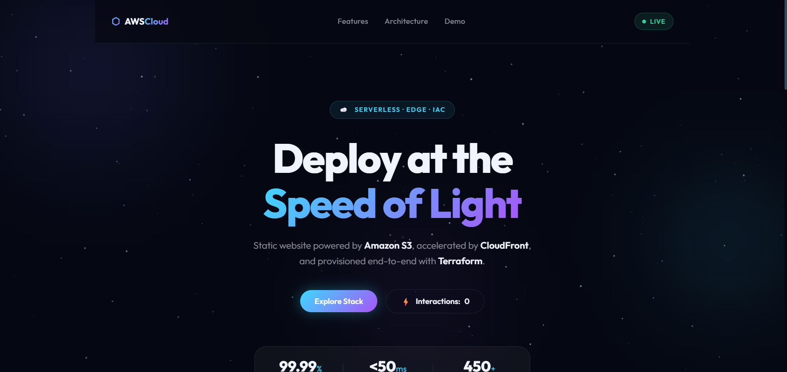
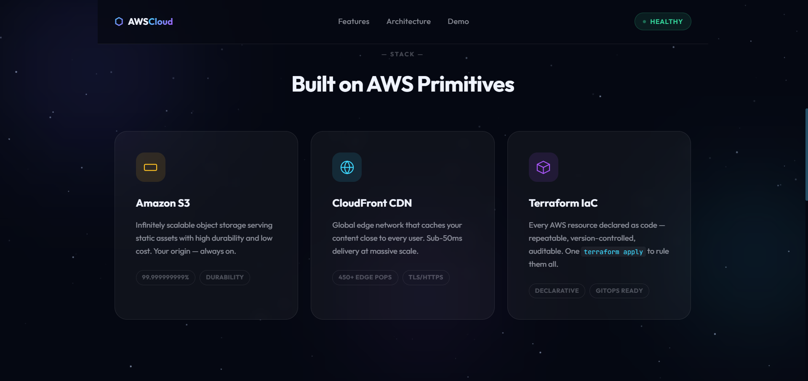
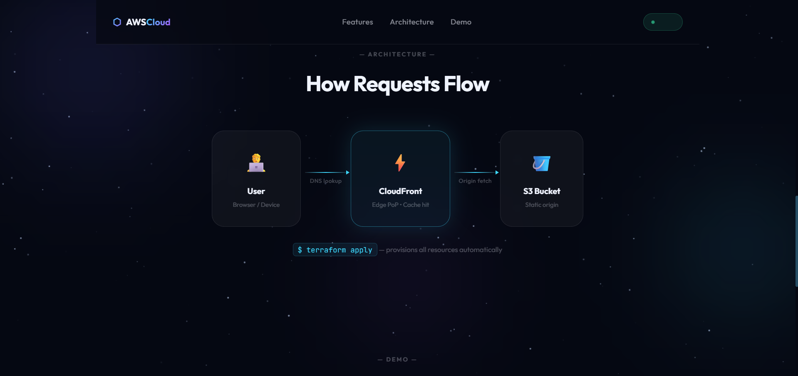
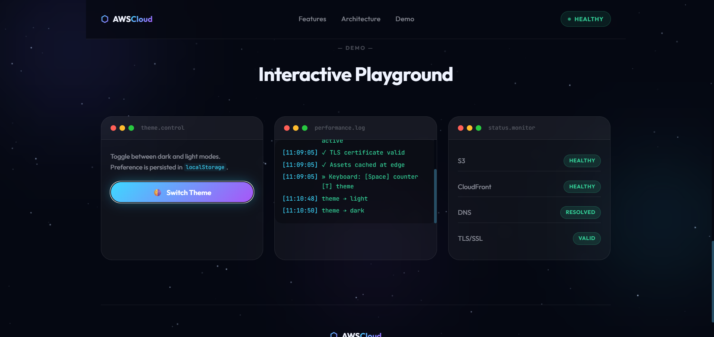

# ☁️ Secure Static Website on AWS

A static website hosted on **Amazon S3** and delivered globally via **CloudFront CDN**, fully provisioned with **Terraform**.

---

## 📸 Preview









---

## 🏗️ Architecture

```
User → CloudFront (Edge CDN) → S3 Bucket (Private Origin)
```

- **S3** stores the static files (HTML, CSS, JS) — bucket is fully private.
- **CloudFront OAC** (Origin Access Control) is the only entity allowed to read from S3.
- All HTTP traffic is automatically redirected to **HTTPS**.

---

## 📁 Project Structure

```
├── main.tf          # S3 bucket, OAC, bucket policy, CloudFront distribution
├── variables.tf     # Input variables (region, bucket prefix)
├── providers.tf     # AWS provider configuration
├── output.tf        # Outputs: website URL, CloudFront ID, S3 bucket name
├── backend.tf       # (Optional) Remote state in S3
└── www/
    ├── index.html   # Website HTML
    ├── style.css    # Styles
    └── script.js    # Interactive logic
```

---

## ⚙️ Prerequisites

- [Terraform](https://developer.hashicorp.com/terraform/downloads) `>= 1.0`
- [AWS CLI](https://docs.aws.amazon.com/cli/latest/userguide/install-cliv2.html) configured with valid credentials
- AWS IAM permissions for S3, CloudFront

---

## 🚀 How to Run

**1. Clone the repository**
```bash
git clone https://github.com/prakashghropade/secure-static-website-on-aws.git
cd secure-static-website-on-aws
```

**2. Configure AWS credentials**
```bash
aws configure
```

**3. Initialise Terraform**
```bash
terraform init
```

**4. Review the plan**
```bash
terraform plan
```

**5. Deploy**
```bash
terraform apply
```

After apply completes, Terraform prints the outputs:

| Output | Description |
|---|---|
| `website_url` | HTTPS URL of your CloudFront website |
| `cloudfront_distribution_id` | CloudFront distribution ID |
| `s3_bucket_name` | Name of the created S3 bucket |

**6. Open your website**

Copy the `website_url` output and paste it in your browser. ✅

---

## 🗑️ Destroy

To tear down all resources:
```bash
terraform destroy
```

---

## 🔧 Variables

| Variable | Default | Description |
|---|---|---|
| `aws_region` | `ap-south-1` | AWS region for all resources |
| `bucket_prefix` | `my-static-bucket` | Prefix used for the S3 bucket name |

Override at apply time:
```bash
terraform apply -var="bucket_prefix=my-site" -var="aws_region=us-east-1"
```
